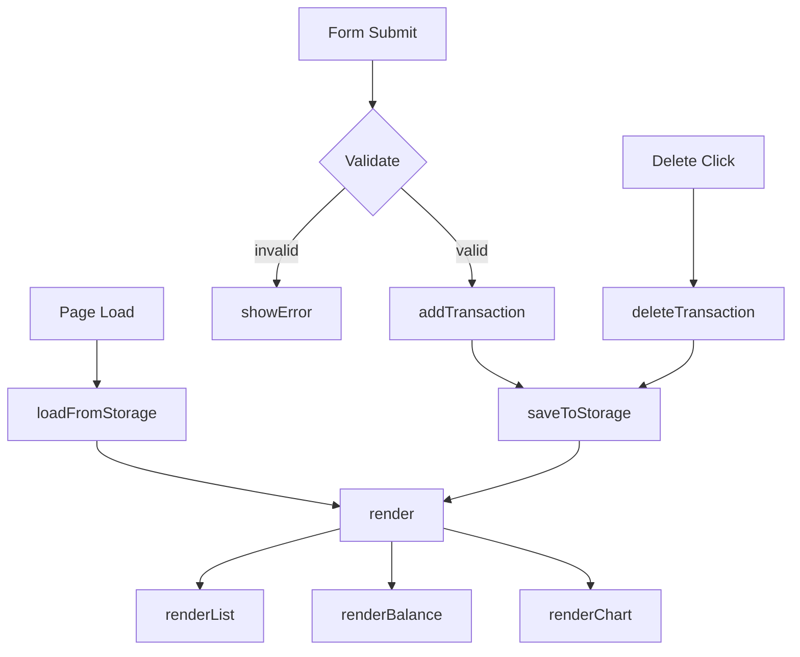

# Design Document: Personal Finance Tracker

## Overview

A single-page client-side web application built with vanilla HTML, CSS, and JavaScript. Users log spending transactions via a form, review them in a scrollable list, track a running balance, and visualize category spending in a pie chart. All data is persisted in `localStorage`. No backend, no build tools, no frameworks — Chart.js is the only external dependency (loaded via CDN).

The app is a single HTML file (`index.html`) with one linked stylesheet (`css/styles.css`) and one linked script (`js/app.js`).

---

## Architecture

The app follows a simple **state → render** cycle:

```
User Action
    │
    ▼
Mutate State (transactions array)
    │
    ▼
Persist to localStorage
    │
    ▼
Re-render UI (list, balance, chart)
```

There is no virtual DOM or reactive framework. Every mutation calls a single `render()` function that rebuilds the dynamic parts of the UI from the current in-memory state.



---

## Components and Interfaces

### HTML Structure (`index.html`)

```
<body>
  <header>          — app title + balance display
  <main>
    <section#form>  — add-transaction form
    <section#list>  — scrollable transaction list
    <section#chart> — pie chart or empty-state message
```

### CSS (`css/styles.css`)

- CSS custom properties for colors and spacing
- Flexbox/Grid layout for responsive single-column (mobile) and two-column (desktop) arrangement
- Media query breakpoint at 768px

### JavaScript (`js/app.js`)

All logic lives in one file, organized into clearly separated concerns:

| Function | Responsibility |
|---|---|
| `loadFromStorage()` | Read and parse transactions from localStorage; handle errors |
| `saveToStorage()` | Serialize and write transactions array to localStorage |
| `addTransaction(name, amount, category)` | Push new transaction, save, render |
| `deleteTransaction(id)` | Filter out transaction by id, save, render |
| `validateForm(name, amount, category)` | Return validation error string or null |
| `render()` | Orchestrate renderList, renderBalance, renderChart |
| `renderList()` | Build transaction list DOM from state |
| `renderBalance()` | Update balance display element |
| `renderChart()` | Create/update Chart.js pie chart or show empty state |
| `showFormError(msg)` | Display inline validation error |
| `clearFormError()` | Remove inline validation error |
| `resetForm()` | Clear form fields to defaults |

### Chart.js Integration

Chart.js is loaded from CDN. A single `Chart` instance is stored in a module-level variable. On each `renderChart()` call, if the instance exists it is destroyed and recreated with fresh data (simplest correct approach for a small dataset).

---

## Data Models

### Transaction

```js
{
  id: string,        // crypto.randomUUID() or Date.now().toString()
  name: string,      // item name, non-empty
  amount: number,    // positive float
  category: string   // "Food" | "Transport" | "Fun"
}
```

### App State

```js
// Module-level variable in app.js
let transactions = [];  // Transaction[]
```

### localStorage Schema

```
Key:   "pft_transactions"
Value: JSON.stringify(Transaction[])
```

### Category Spending Aggregate (derived, not stored)

```js
// Computed in renderChart()
{
  Food: number,
  Transport: number,
  Fun: number
}
```

---

## Correctness Properties

*A property is a characteristic or behavior that should hold true across all valid executions of a system — essentially, a formal statement about what the system should do. Properties serve as the bridge between human-readable specifications and machine-verifiable correctness guarantees.*

### Property 1: Valid transaction add grows list and persists

*For any* valid transaction (non-empty name, positive amount, valid category), submitting it via the form shall increase the transaction list length by exactly one and the new transaction shall be present in localStorage.

**Validates: Requirements 1.2, 5.1**

### Property 2: Invalid input is rejected without side effects

*For any* form submission where at least one field is empty or the amount is non-positive, the app shall display a validation error and the transaction list shall remain unchanged (same length and same contents as before the submission).

**Validates: Requirements 1.3**

### Property 3: Form resets after successful add

*For any* valid transaction successfully added, all form fields (name, amount, category) shall be reset to their default empty/unselected state immediately after submission.

**Validates: Requirements 1.4**

### Property 4: List renders every transaction with all required fields

*For any* non-empty set of transactions in state, the rendered transaction list DOM shall contain one entry per transaction, and each entry shall display the item name, amount, and category of that transaction.

**Validates: Requirements 2.1**

### Property 5: Delete removes transaction from list and storage

*For any* transaction that exists in the list, clicking its delete control shall result in that transaction being absent from both the rendered list and from localStorage.

**Validates: Requirements 2.3, 5.1**

### Property 6: Balance equals sum of all transaction amounts

*For any* set of transactions (including the empty set), the balance value displayed in the UI shall equal the arithmetic sum of all transaction amounts (zero when the set is empty).

**Validates: Requirements 3.1, 3.2, 3.3**

### Property 7: Chart data matches per-category spending totals

*For any* non-empty set of transactions, the data values passed to the Chart.js instance shall equal the sum of amounts for each category present, and only categories with at least one transaction shall appear as chart segments.

**Validates: Requirements 4.1, 4.2**

### Property 8: Load from storage restores full app state

*For any* transaction list serialized to localStorage, calling the load function shall restore the in-memory transactions array to an equivalent list, and the rendered balance and chart shall reflect that restored state.

**Validates: Requirements 5.2**

---

## Error Handling

| Scenario | Handling |
|---|---|
| Form submitted with empty name | Inline error: "Item name is required." Form not submitted. |
| Form submitted with empty/zero/negative amount | Inline error: "Amount must be a positive number." Form not submitted. |
| Form submitted with no category selected | Inline error: "Please select a category." Form not submitted. |
| localStorage unavailable on load | Catch exception, initialize `transactions = []`, show non-blocking banner warning. |
| localStorage contains invalid JSON on load | Catch `JSON.parse` exception, initialize `transactions = []`, show non-blocking banner warning. |
| localStorage write fails (e.g. quota exceeded) | Catch exception, show non-blocking banner warning; in-memory state remains valid. |
| Chart.js not loaded (CDN failure) | `renderChart()` guards with `typeof Chart !== 'undefined'`; shows fallback message. |

---

## Testing Strategy

### Unit / Example Tests

Focus on concrete scenarios and edge cases that don't benefit from input variation:

- Form renders with all three required fields (name, amount, category select)
- Empty state message shown when transaction list is empty
- Storage parse error on load → empty state + warning displayed
- Storage unavailable on load → empty state + warning displayed
- Semantic labels are associated with all form inputs (accessibility)

### Property-Based Tests

Property-based testing library: **fast-check** (JavaScript, runs in Node with jsdom or a browser test runner).

Each property test runs a minimum of **100 iterations**.

Each test is tagged with a comment in the format:
`// Feature: personal-finance-tracker, Property N: <property text>`

| Property | Test description |
|---|---|
| Property 1 | Generate random valid transactions; verify list length +1 and localStorage contains entry |
| Property 2 | Generate invalid submissions; verify error shown and list unchanged |
| Property 3 | Generate random valid transactions; verify form fields empty after add |
| Property 4 | Generate random transaction arrays; verify DOM list entry count and field content |
| Property 5 | Generate random transactions; add then delete; verify absent from DOM and localStorage |
| Property 6 | Generate random transaction arrays; verify balance display equals `amounts.reduce((s,a) => s+a, 0)` |
| Property 7 | Generate random transactions across categories; verify chart dataset values match per-category sums |
| Property 8 | Generate random transaction arrays; serialize to localStorage; reload; verify restored state matches |

### Integration / Smoke Tests

- App renders without errors in a real browser at 320px, 768px, and 1920px viewport widths (manual or Playwright)
- All interactive controls respond within 100ms (Lighthouse or manual timing)
